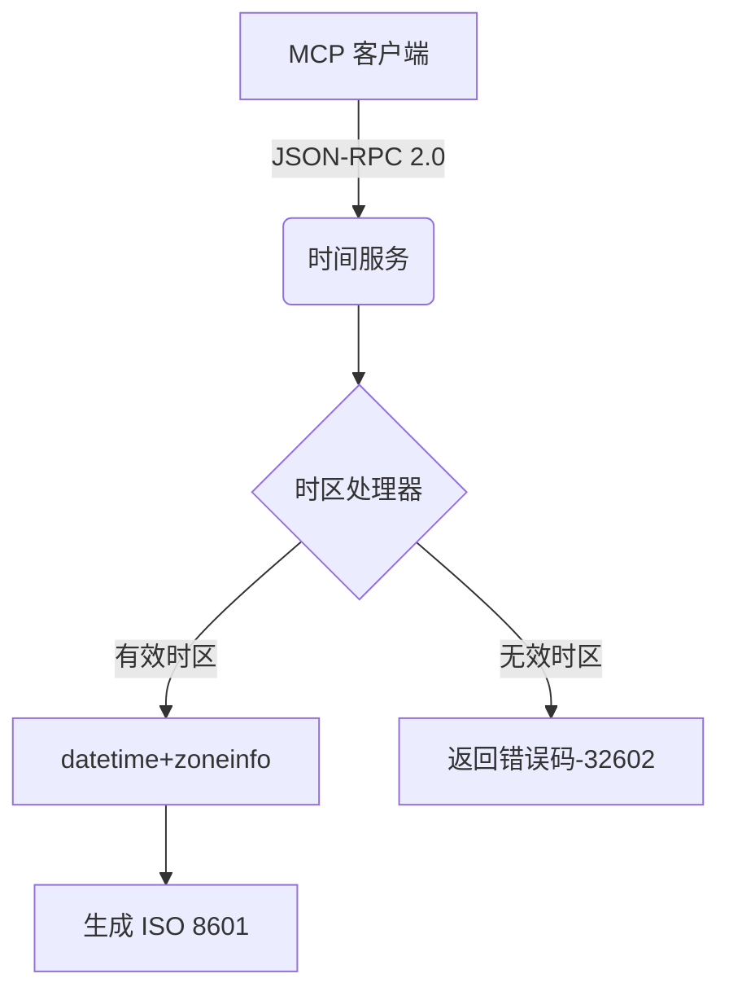

# MCP 时间服务 - 实时时间获取服务  

   
 [](https://opensource.org/licenses/MIT)

> 轻量级 MCP 协议服务，提供 ISO 8601 标准格式的实时时间数据，支持全球时区查询，专为 LLM 应用设计的上下文服务

## 🔍 核心功能
- **实时时间获取**：毫秒级响应当前精确时间
- **全球时区支持**：通过时区参数获取任意地区时间（如 `Asia/Shanghai`）
- **标准化输出**：返回 `ISO 8601` 格式时间（示例：`2025-07-16T14:30:00+08:00`）
- **零配置运行**：默认使用 UTC 时区开箱即用
- **MCP 协议兼容**：完美对接 ModelScope 生态

## ⚙️ 技术架构



## 🚀 快速启动
### 本地运行
```bash
# 克隆仓库
git clone https://github.com/yourusername/time-mcp-demo.git

# 进入项目目录
cd time-mcp-demo

# 安装依赖（建议使用虚拟环境）
pip install -r requirements.txt

# 启动服务（默认端口8000）
python src/time_service.py
```


### 服务测试
```bash
# 使用 curl 测试服务
curl -X POST http://localhost:8000 \
-H "Content-Type: application/json" \
-d '{
  "jsonrpc": "2.0",
  "method": "get_time",
  "params": {"timezone": "Asia/Shanghai"},
  "id": "test-001"
}'
```


✅ 成功响应：
```json
{
  "jsonrpc": "2.0",
  "result": "2025-07-16T14:30:00+08:00",
  "id": "test-001"
}
```


## 🌐 ModelScope 部署
### 准备工作
1. 在 [ModelScope](https://modelscope.cn) 注册账号
2. 创建 MCP 服务访问密钥（控制台 > 密钥管理）
3. 将 GitHub 仓库设为公开（Private 仓库需配置 OAuth 授权）

### 部署流程
1. **进入 MCP 广场**  
   ModelScope 控制台 > MCP 广场 > 创建新服务

2. **配置服务参数**  

   | 参数项          | 填写值                          |
   |----------------|--------------------------------|
   | 服务名称        | `time-service` (中英文均可)     |
   | 部署类型        | ✅ 可托管部署（免费资源）         |
   | 代码仓库        | 粘贴 GitHub 仓库 URL            |
   | 入口点          | `src.time_service:get_current_time` |
   | Python 版本     | `3.10`                          |


3. **设置环境变量（可选）**  

   | 变量名             | 推荐值          |
   |-------------------|----------------|
   | `DEFAULT_TIMEZONE` | `UTC`          |
   | `LOG_LEVEL`        | `INFO`         |


4. **启动部署**  
   点击 `创建并部署` → 等待状态变为 `运行中`（约2分钟）

### 获取调用端点
部署成功后，在服务详情页获取：
- **SSE 调用地址**：`wss://service-xxxx.modelscope.cn`
- **API 密钥**：在「安全凭证」标签页查看

## 📡 API 规范
### 请求格式
```http
POST / HTTP/1.1
Authorization: Bearer <API_KEY>
X-Secret: <SECRET_KEY>  # 仅私有服务需要
Content-Type: application/json

{
  "jsonrpc": "2.0",
  "method": "get_time",
  "params": {
    "timezone": "America/New_York"  # 可选参数
  },
  "id": "client-001"
}
```


### 响应格式

| 状态码 | 响应体                                | 说明                |
|--------|--------------------------------------|-------------------|
| 200    | `{"jsonrpc":"2.0", "result":"...", "id":"..."}` | 成功               |
| 400    | `{"code":-32602, "message":"Invalid timezone"}` | 无效时区参数       |
| 403    | `{"code":-32001, "message":"Unauthorized"}`    | 认证失败           |


## 🛠️ 开发指南
### 项目结构
```bash
├── src/
│   └── time_service.py  # 服务主逻辑
├── tests/               # 单元测试
├── pyproject.toml       # MCP 入口点配置
├── requirements.txt     # Python 依赖
└── README.md
```


### 扩展开发
```python
# 添加新功能示例（返回时间戳）
@mcp.tool(name="get_timestamp", description="返回UNIX时间戳")
def get_timestamp() -> int:
    return int(datetime.now().timestamp())
```


## 🔧 故障排除

| 问题现象                  | 解决方案                     |
|--------------------------|----------------------------|
| 部署时提示入口点无效      | 检查 `pyproject.toml` 中的 `[tool.setuptools.entry-points]` 配置 |
| 时区参数返回错误          | 确认时区名称符合 [IANA 时区数据库](https://en.wikipedia.org/wiki/List_of_tz_database_time_zones)规范 |
| 云服务启动超时            | 确保服务监听地址为 `0.0.0.0` |
| API调用返回403错误        | 检查 ModelScope 控制台的密钥绑定状态 |


## 🤝 参与贡献
1. Fork 本项目仓库
2. 创建特性分支 (`git checkout -b feature/new-feature`)
3. 提交代码 (`git commit -am 'Add new feature'`)
4. 推送分支 (`git push origin feature/new-feature`)
5. 创建 Pull Request

## 📜 许可证
本项目基于 [MIT License](LICENSE) 开源
